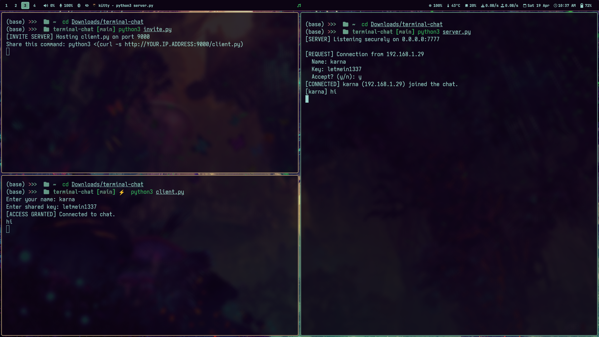

# Terminal Chat

A fully **terminal-based**, **TLS-encrypted**, and **manually-approved** chat application built for maximum privacy and minimalism. No UI, no cloud, no sharing of client files — just a one-liner invite command with tight access control.

---

## 💡 Features

- 🔐 **TLS Encryption** – All communication is secured using SSL.
- 👤 **Name + Key Authentication** – Clients submit their name and a shared secret.
- ✋ **Manual Approval** – Server prompts for each connection; only approved users join.
- 🧠 **No Client Code Sharing** – Clients fetch the bootstrap client code via a secure one-liner.
- 🧼 **Minimal & Clean** – 100% terminal-based. No GUI distractions.

---

## 📁 Directory Structure

```
secure_terminal_chat/
├── server.py            # Main chat server with TLS & approval logic
├── client.py       # Lightweight, secure bootstrap client (fetched remotely)
├── invite.py      # Tiny HTTP server to serve the client_boot.py file
├── certs/
│   ├── cert.pem         # TLS certificate
│   └── key.pem          # TLS private key
```

---

## 🚀 How to Use

### 1. 🔧 Setup TLS Certs
```bash
mkdir certs
openssl req -new -x509 -days 365 -nodes -out certs/cert.pem -keyout certs/key.pem
```

### 2. 🔐 Start the Chat Server
```bash
python3 server.py
```
You’ll see prompts for each connection request:
```
[REQUEST] Connection from 192.168.1.23
  Name: Karna
  Key: letmein1337
  Accept? (y/n):
```

### 3. 🌐 Start the Invite Host
```bash
python3 invite.py
```

This serves `client.py` to the public via HTTP on port `9000`.

### 4. 🧑‍💻 Share the Invite Command
Give this to your friends:
```bash
python3 <(curl -s http://YOUR.IP.ADDRESS:9000/client.py)
```
They’ll be prompted for their name and shared key. You’ll be asked to accept or deny.

> 🔒 They **never see or get the code**, and only **you** can approve who joins.

---

## ⚙️ Configuration

Inside `server.py` and `client_boot.py`, set:
```python
PORT = 7777
SHARED_KEY = 'letmein1337'
```
Update `HOST` in `client_boot.py` to your actual IP (or automate it via `serve_invite.py`).



---

## 🔐 Security Tips
- Change your TLS certs regularly.
- Use a strong shared key.
- Change ports often.
- Never run this on open Wi-Fi without a VPN.
- Use firewall rules to restrict unexpected traffic.

---

## 💡 Future Improvements
- 🔐 Per-user tokens or dynamic shared keys
- 🛡️ IP rate-limiting
- ⏳ One-time access links with expiration
- 📜 Chat logs (optional)
- 🧰 Admin commands like `/kick` or `/mute`

---

## 📜 License
MIT License – use it, fork it, break it, love it ☕
